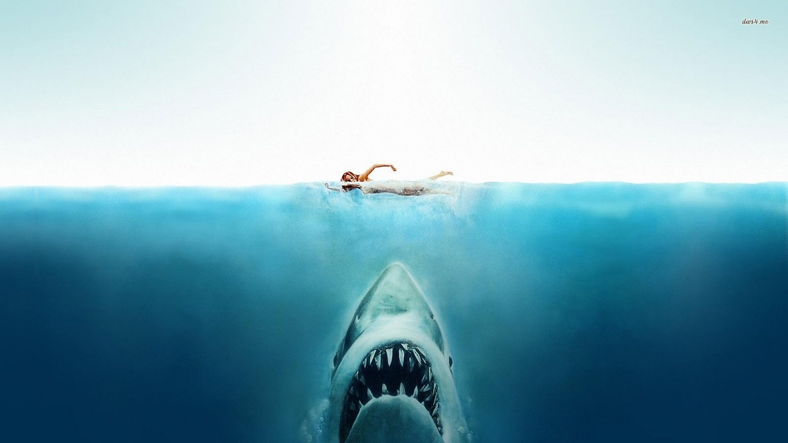

# global-shark-attacks

## Objective

Use a ML model to predict if a person will die or not in a shark attack.
Hence Classification Project.

## Data

### Data Source

The full dataset downloaded 29-09-2016. Each row corresponds to a shark attack. Columns:
https://www.kaggle.com/teajay/global-shark-attacks

### Shape of the Data

The dataframe consits of 25723 rows × 24 columns:
1. Case Number
2. Date
3. Year
4. Type
5. Country
6. Area
7. Location
8. Activity
9. Name
10. Sex
11. Age
12. Injury
13. Fatal (Y/N)
14. Time
15. Species
16. Investigator or Source

### Workflow

#### Load, First Review and Clean

#### Deep Dive Python

#### Deep Dive Tableau

#### EDA

## Python Libraries
- [pandas](https://pandas.pydata.org/)
- [numpy](https://numpy.org/)
- [seaborn](https://seaborn.pydata.org/)
- [matplotlib](https://matplotlib.org/)
- [statsmodels](https://www.statsmodels.org/stable/index.html)
- [scipy](https://www.scipy.org/)
- [sklearn](https://scikit-learn.org/stable/)
